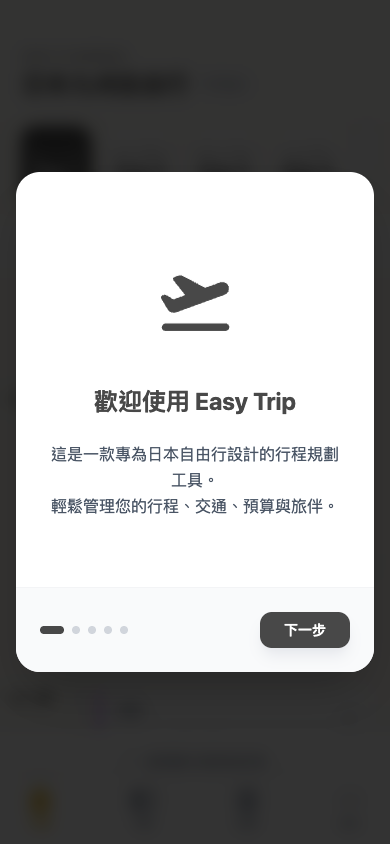
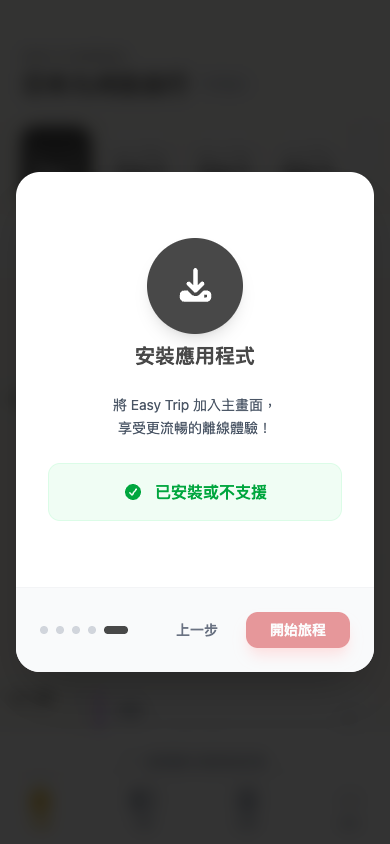
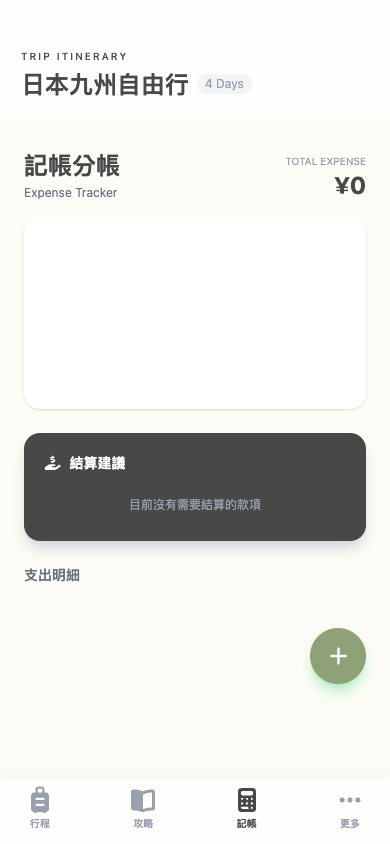

# TravelApp 整體功能導覽地圖

此文件整理了專案中主要路由所對應的畫面及其核心功能，全應用以 Vue3 + Vite + Web 技術 (Leaflet, MediaPipe, Chart.js) 構建。

## 功能結構樹狀圖 (Feature Tree)
這是一份以資料夾結構呈現的完整功能清單，方便快速總覽所有系統功能及層級關係：

```text
TravelApp (Easy Trip)
├── 新手導覽 (Onboarding Tour)
│   ├── 1. 歡迎頁
│   ├── 2. 核心功能介紹
│   ├── 3. AI 智慧助手說明
│   ├── 4. 範例資料提示
│   └── 5. PWA 安裝應用程式教學
├── 1. 行程規劃 (Itinerary: /)
│   ├── 日期切換與選擇器
│   ├── 雙重視圖切換
│   │   ├── 清單模式 (列表、時間軸)
│   │   └── 地圖模式 (Leaflet動態路徑)
│   ├── 每日行程管理
│   │   ├── 拖曳排序與時間自動重算
│   │   ├── 新增/編輯單筆行程細節
│   │   └── 交通時間與串接點
│   ├── 預算與花費預估檢視
│   └── 備案庫管理 (可隨時升級為正式行程)
├── 2. 深度導覽 (Guides: /guides)
│   ├── 攻略收藏卡片列表
│   ├── 景點狀態流轉 (想去 → 已排程 → 已去過)
│   ├── 一鍵加入行程表
│   └── 智慧 AI 匯入 (解析外部連結/文字)
├── 3. 記帳分帳 (Accounting: /accounting)
│   ├── 總花費與圓餅圖分析 (Chart.js)
│   ├── 自動分帳與最佳結算建議
│   └── 支出明細管理 (新增/編輯/自訂分攤比例)
├── 4. 實用日語對話 (Conversation: /conversation)
│   ├── 情境分類短句庫
│   ├── AI 雙向生成與情境推薦對話
│   ├── 自訂對話管理
│   └── 系統內建語音朗讀 (TTS)
├── 5. 準備清單 (Checklist: /checklist)
│   ├── 自訂清單分類頁籤 (如：出發前、行李)
│   ├── 待辦項目勾選與移除
│   └── 視覺化完成進度條
├── 6. Vlog 拍攝腳本 (Vlog Script: /vlog-script)
│   ├── 按天數載入目前行程
│   ├── AI 專業分鏡腳本生成 (含鏡頭運鏡建議)
│   └── 快捷導向專屬相機練習模式
└── 7. AI 智慧相機 (AI Camera: /ai-camera)
    ├── 人像模式 (Portrait)
    │   └── MediaPipe Pose 姿勢偵測 (舉起雙手自動拍照)
    ├── 風景模式 (Landscape)
    │   ├── 智慧水平儀 (陀螺儀感測)
    │   └── 螢幕焦點參考輔助線
    └── 運鏡練習模式 (Vlog)
        ├── 幽靈框 (Ghost Box) 指導介面
        ├── 即時進度條與運鏡動態回饋
        └── 速度及穩定度警告提示
```
## 新手快速導覽 (Onboarding Tour)
當使用者初次進入 App 時，系統會自動彈出「快速導覽」介紹核心功能，共有以下 5 個導覽頁面：

### 1. 歡迎頁

### 2. 全方位功能介紹

### 3. AI 智慧助手介紹

### 4. 範例資料說明

### 5. 安裝應用程式教學


---

## 主路由與畫面總覽
路徑定義於 `src/router/index.ts`，共有 7 個主要畫面：

### 1. 行程規劃 (ItineraryView)

- **路徑**: `/`
- **核心功能**:
  - **雙模式檢視**：支援在「行程清單」與「地圖 (Map)」間切換，地圖使用 Leaflet 標記當日路徑。
  - **直覺排程**：整合 SortableJS 實現拖曳重新排序行程，系統自動重算並調整後續行程時間。
  - **備案與預算追蹤**：底部提供各幣別當日與總預估花費，並可設定行程備案（隨時將備案升級加入正式行程）。
  - **智慧助理入口**：對於沒有行程的日子，提供按鈕開啟 AI 助手以自動生成行程。

### 2. 深度導覽 (GuidesView)

- **路徑**: `/guides`
- **核心功能**:
  - **攻略收藏庫**：整合多種媒體來源（Web, Instagram, YouTube 等），透過視覺卡片顯示。
  - **狀態流轉**：可以把景點狀態分類為「想去」、「已排程」、「已去過」，並快速一鍵「加入行程」。
  - **AI 智能匯入**：使用者可利用 AI 將外部連結或文字解析為結構化景點資訊。

### 3. 記帳分帳 (AccountingView)

- **路徑**: `/accounting`
- **核心功能**:
  - **圖表分析**：使用 Chart.js 提供「甜甜圈圖 (Doughnut Chart)」一目了然各類別支出比例。
  - **分帳結算引擎**：自動統整並計算同行旅客之間的代墊與欠款，最佳化產出「誰該轉給誰多少錢」的結算建議。
  - **費用明細**：支援新增、編輯並設定該筆費用是「平分」或「自訂比例」。

### 4. 實用日語對話 (ConversationView)

- **路徑**: `/conversation`
- **核心功能**:
  - **情境對話本**：以分類標籤展示各情境（過海關、交通等）常用的日文短句。
  - **AI 智慧生成與翻譯**：利用 Gemini AI，輸入中文即可自動翻譯或生成當地禮貌用語。
  - **即時發音**：整合瀏覽器 Web Speech API 提供標準日本語音朗讀。

### 5. 準備清單 (ChecklistView)

- **路徑**: `/checklist`
- **核心功能**:
  - **分類待辦**：例如出發前準備、隨身物品、行李清單等切換頁籤。
  - **進度可視化**：以完成度數值與進度條即時反映目前的準備狀況。
  - **靈活編輯**：支援使用者自訂新增、刪除分類與修改個別檢查項目。

### 6. Vlog 拍攝腳本 (VlogScriptView)

- **路徑**: `/vlog-script`
- **核心功能**:
  - **AI 導演企劃**：根據使用者選擇的行程天數與景點，透過系統 Prompt 請 AI 自動產生具備蒙太奇或電影感的分鏡腳本。
  - **腳本格式化**：每張腳本卡片會詳細註記：主體內容、拍攝動作、運鏡手法及預估秒數。
  - **實機練習連結**：點擊卡片上標示之指定運鏡手法（如 Pan、Tilt），可快速引導進入 `AiCameraView` 的對應訓練模式。

### 7. AI 相機 (AiCameraView)

- **路徑**: `/ai-camera`
- **核心功能**:
  - **人像模式 (Portrait)**：導入 `@mediapipe/tasks-vision` 實現裝置端的 Pose Landmarker 偵測，實現「雙手舉高即自動開始倒數 3 秒拍照」的功能。
  - **風景模式 (Landscape)**：藉由 HTML5 `DeviceOrientationEvent` 取得裝置角度，提供畫面智能水平儀及點擊動態改變視覺焦點等輔助線構圖。
  - **運鏡練習模式 (Vlog)**：配合上方腳本功能，以「幽靈框 (Ghost Box)」作為引導基準，配合即時進度條與速度/穩定度警告詞，指導使用者完成平滑的錄影運鏡。
